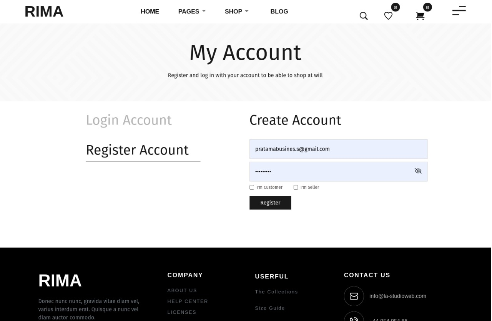
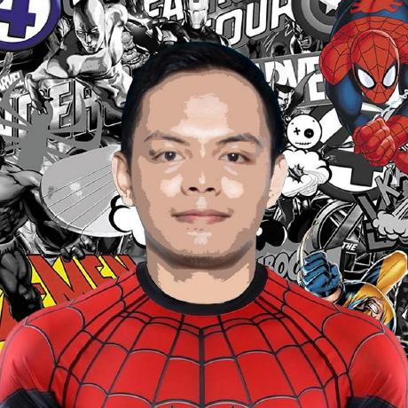

<h1 align="center">RIMA FURNITURE</h1>

  Built with React JS.

## Table of Contents

- [Introduction](#introduction)
- [Features](#features)
- [Requirements](#requirements)
- [Usage](#usage-for-development)
- [Screenshots](#screenshots)
- [Contributors](#contributors)

## Introduction
<b>Rima Furniture</b> one-stop solution for buying furniture.
<tr>You can test the web online here: https://rima-project.vercel.app</tr>

## Features
* Order feature for customer
* Admin feature
* Payment feature
* And others

## Requirements
* [`react js`](https://reactjs.org/)

## Usage for development
1. Open your terminal or command prompt
2. Type `git clone https://github.com/rzkiyprtm/rima-project.git`
3. Open with your text editor
4. Start to edit and develop

## Screenshots

       
     
     
     
     
     
     
     

## Related Project
* [`Rima Furniture Backend`](https://github.com/salzteam/RIMA-BE)

## Contributors

  <table>
    <tr>
      <td align="center">
        <a href="https://github.com/rzkiyprtm">
           
          <b>Rizky Putra Pratama</b>
        </a>
        </td>
        <td align="center">
         <a href="https://github.com/rzkiyprtm">
           
          <b>Aksal Rizki Gandari</b>
        </a>
        </td>
      <td align="center">
      <a href="https://github.com/rzkiyprtm">
           
          <b>Imam Basri</b>
        </a>
      </td>
      <td align="center">
      <a href="https://github.com/rzkiyprtm">
           
          <b>Mo Ikrom</b>
        </a>
      </td>
    </tr>
  </table>

